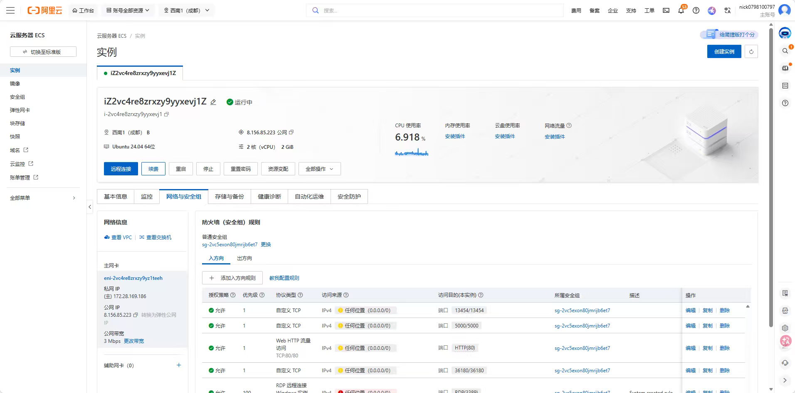
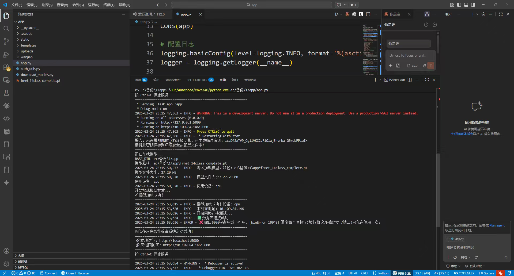

# 智影融析 — 基于深度学习的肺部疾病智能筛查系统

[](https://www.python.org/)
[](https://pytorch.org/)
[](https://flask.palletsprojects.com/)

> 基于 FHRNet（高分辨率特征融合网络）的胸部 X 光片 14 种疾病智能筛查平台  
> 🏆 大学生创新训练计划项目

## 📋 项目简介

本系统利用深度学习技术，对胸部 X 光片进行自动化分析，可同时检测 **14 种常见胸部疾病**。采用 FHRNet（高分辨率特征融合网络）+ DenseNet-121 架构，结合深度生成分类器（DGC），在 ChestX-ray14 数据集上实现高精度多标签分类。系统提供 Web 交互界面，支持影像上传、AI 分析、热力图可视化、健康管理等功能。

## 🖼️ 系统展示

| 系统架构 | 软件界面 |
|:---:|:---:|
|  |  |

## 🔬 14 种检测疾病

| 英文名 | 中文名 | 英文名 | 中文名 |
|--------|--------|--------|--------|
| Atelectasis | 肺不张 | Cardiomegaly | 心脏肥大 |
| Effusion | 胸腔积液 | Infiltration | 浸润 |
| Mass | 肿块 | Nodule | 结节 |
| Pneumonia | 肺炎 | Pneumothorax | 气胸 |
| Consolidation | 实变 | Edema | 水肿 |
| Emphysema | 肺气肿 | Fibrosis | 纤维化 |
| Pleural Thickening | 胸膜增厚 | Hernia | 疝气 |

## 🏗️ 技术架构

```
胸部 X 光片上传 → Flask Web 前端
                      ↓
              DenseNet-121 (ImageNet 预训练)
              + FHRNet 高分辨率特征融合
              + DGC 深度生成分类器
                      ↓
              14 类疾病概率输出
                      ↓
         Grad-CAM 热力图 → 辅助诊断报告
```

## 🎯 主要功能

- **胸部 X 光片上传与分析**：支持 JPG / PNG / DICOM 格式
- **14 种疾病智能分类**：基于 ChestX-ray14 数据集（112,120 张图像）训练
- **病灶区域热力图**：Grad-CAM 可视化，直观标记可疑区域
- **肺康 e 管家**：患者健康记录管理与随访
- **肺悦智联社区**：医患交流平台
- **AI 智能咨询**：问答助手，解答肺部健康问题

## 📂 项目结构

```
├── app.py                     # Flask Web 应用入口
├── model_utils.py             # 模型加载与推理（ChestXrayModel）
├── create_pth_model.py        # 模型权重文件生成
├── download_sample_images.py  # 示例图像下载
├── requirements.txt           # Python 依赖
├── FHRnet/                    # 高分辨率特征融合网络
│   ├── dcnn.py               # DenseNet-121 / ResNet-50 定义
│   ├── run_baseline.py       # 基线模型训练脚本
│   └── run_dgc.py            # DGC 深度生成分类器训练
├── model_code/                # 模型参考实现
│   └── deep-generative-classifiers-master/
├── static/                    # CSS / JS / 图片资源
├── templates/                 # HTML 页面模板
├── results/                   # 模型评测结果（AUC）
└── images/                    # 项目截图
```

## 🚀 快速开始

### 1. 安装依赖

```bash
pip install -r requirements.txt
```

### 2. 生成模型权重

```bash
python create_pth_model.py
```

### 3. 启动应用

```bash
python app.py
```

浏览器访问 `http://localhost:5000`

## 🛠️ 技术栈

| 技术 | 用途 |
|------|------|
| **PyTorch** | 深度学习框架 |
| **DenseNet-121 / ResNet-50** | 骨干网络（ImageNet 预训练） |
| **FHRNet** | 高分辨率特征融合网络 |
| **DGC（Deep Generative Classifier）** | 深度生成式分类 |
| **Grad-CAM** | 病灶热力图生成 |
| **Flask** | Web 后端框架 |
| **OpenCV / PIL** | 医学图像处理 |
| **HTML / CSS / JavaScript** | 前端界面 |

## 📊 模型性能

基于 ChestX-ray14 数据集（112,120 张胸部 X 光片），模型在多标签分类任务上的评测结果详见 `results/` 目录。

## ⚠️ 免责声明

本系统仅供**辅助诊断参考**，不能替代专业医生的诊断意见。

## 👤 作者

- **罗楠** - 西南医科大学 生物医学工程专业
- GitHub: [@nan2342](https://github.com/nan2342)
